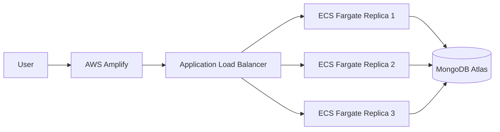

# KP Enterprise Architecture

## System Summary
KP Enterprise uses a standard 3-tier production layout. The frontend is hosted on AWS Amplify, which serves the React application globally. The backend is a Node.js and Express service deployed as exactly 3 containerized replicas on Amazon ECS Fargate behind an Application Load Balancer. Operational data is stored externally in MongoDB Atlas, which provides its own native replica set and high availability.

The backend is designed to be stateless at the container layer. Any task can be replaced without losing application state because the durable system of record lives in MongoDB Atlas, while identity and session tokens are handled by JWT.

## Traffic Flow

```text
User
  -> AWS Amplify Frontend
  -> Application Load Balancer
  -> ECS Fargate Service (3 running tasks)
  -> MongoDB Atlas Replica Set
```



## Boundary Of Responsibility

### Developer Boundary
The development team owns application code, API behavior, containerization, ECS task definitions, secrets wiring, health checks, build pipelines, and day-to-day changes to backend logic.

### CEO Boundary
Leadership owns business decisions, budget approval, operational priorities, vendor contracts, and the acceptance of architecture tradeoffs such as managed cloud services, redundancy level, and availability targets.

## Horizontal Scaling And High Availability

The backend is horizontally scaled by increasing ECS task count, with the steady-state target fixed at 3 tasks for production. The Application Load Balancer distributes traffic across the healthy tasks and removes any unhealthy replica from rotation automatically.

High availability comes from three layers. ECS Fargate replaces failed tasks, the ALB performs health checks against `/api/health`, and MongoDB Atlas maintains the database replica set independently of the application tier. Because the service is stateless, a failed task can be restarted or replaced without user-visible data loss.

## Production Notes

- Container port: `5000`
- Health check path: `/api/health`
- Production secrets: `MONGODB_URI` and `JWT_SECRET`
- Recommended secret source: AWS Secrets Manager or AWS Systems Manager Parameter Store
- Deployment model: ECS Fargate, no Kubernetes
